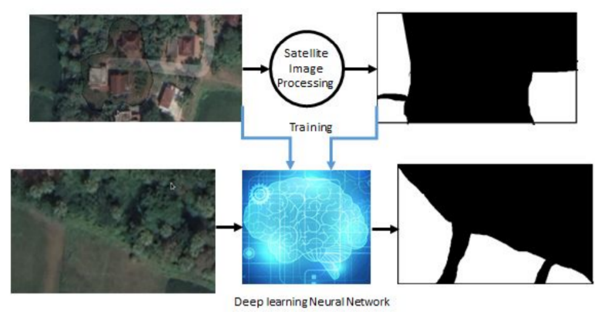

# Hi, Welcome to AgroSat
## Problem Steatement
Develop a system that uses satellite image and give an aprox calculation of change in wetland and dryland of a perticular area.
## Project In Nutshell
Wetland – Dryland Statistics Using Satellite Image:
<ul>
<li>	
  Using Machine Learning and Satellite Image Processing, system identifies wet land from Satellite Image  and calculate area of wetland,changes happened from last 10 years 
</li>
<li> 
  Using Fully Convolutional Network(FCN) Architecture, Integrated with a web application for user friendliness 
</li>
<li>
  Tools Used : TensorFlow, Keras, Scikit learn, NumPy, matplotlib, MySQL
</li>
</ul>

## Model Architecture 
```python
from tensorflow.python.keras.layers import *
from tensorflow.python.keras import *
inputs = Input((128, 128, 3))
.
.
.
outputs = Conv2D(1, (1, 1), activation='sigmoid') (c9)
model = Model(inputs=[inputs], outputs=[outputs])
model.compile(optimizer='adam', loss='binary_crossentropy', metrics=['accuracy'])
```
### Model summery
```
Layer (type)                    Output Shape         Param #     Connected to                     
==================================================================================================
input_6 (InputLayer)            [(None, 128, 128, 3) 0                                            
__________________________________________________________________________________________________
lambda_5 (Lambda)               (None, 128, 128, 3)  0           input_6[0][0]                    
__________________________________________________________________________________________________
conv2d_68 (Conv2D)              (None, 128, 128, 8)  224         lambda_5[0][0]                   
__________________________________________________________________________________________________
conv2d_69 (Conv2D)              (None, 128, 128, 8)  584         conv2d_68[0][0]                  
__________________________________________________________________________________________________
max_pooling2d_20 (MaxPooling2D) (None, 64, 64, 8)    0           conv2d_69[0][0]                  
__________________________________________________________________________________________________
.
.
.
conv2d_84 (Conv2D)              (None, 128, 128, 8)  1160        concatenate_14[0][0]             
__________________________________________________________________________________________________
conv2d_85 (Conv2D)              (None, 128, 128, 8)  584         conv2d_84[0][0]                  
__________________________________________________________________________________________________
conv2d_86 (Conv2D)              (None, 128, 128, 1)  9           conv2d_85[0][0]                  
==================================================================================================
Total params: 485,817
Trainable params: 485,817
Non-trainable params: 0
__________________________________________________________________________________________________
```
### Calculation of Change in area by Area accept Ratio
```python
area_of_first_image = (Num_of_WhitePixel_in_First_image/totalPxArea)*totalArea
area_of_first_image = (Num_of_WhitePixel_in_Second_image/totalPxArea)*totalArea
difference_of_area = areaPro1 - areaPro2
```
## Project Snapshot:

<ul>
  <li> Use stellite Image and its corresponding mask as training data </li>
  <li> Get mask of given Image </li>
</ul>  

